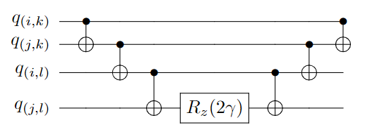

# QAOA_Hadamard_Finder
Implementation of QAOA to find an n-by-n Hadamard matrix. 

A Hadamard matrix, $H$,
is an n-by-n matrix with all entries equal to either +1 or -1, such that any two distinct columns are orthonal (have dot product equal to zero). 
This condition is equivilant to $HH^T=nI$.

For example, a 2-by-2 Hadamard matrix can be
$$H_2=\begin{bmatrix}1&1\\\ 1&-1\end{bmatrix},$$
since the two columns are orthogonal, which is related to the Hadamard gate in quantum computing
$$\frac{1}{\sqrt{2}}\begin{bmatrix}1&1\\\ 1&-1\end{bmatrix}.$$

It can be shown that if $H$
is an n-by-n Hadamard matrix, then it must be the case $n=1,2$
or $n$
is a multiple of 4. We don't know if the converse is true, however.

This problem is called the **Hadamard conjecture**: if $n$ is a multiple of 4 then an
n-by-n Hadamard matrix exists. We know that the conjecture is true if $n$
is a power of 2 (we can compute the tensor product $H_2^{\otimes n}$
to get a $2^n$
-by-
$2^n$
Hadamard matrix). We also know that the conjecture is true for values of $n$
that are a product of a power of 2 and factors of the form $p^t+1$
, where $p$ is prime and $p^t+1$
is divisible by 4.

The smalled multiple of 4, for which we don't know whether or not a Hadamard matrix exists is $n=668$.

We apply the [Quantum Approximate Optimization Algorithm (QAOA)](https://qiskit.org/textbook/ch-applications/qaoa.html) as a proposed method for finding these matrices. This is a hybrid algorithm that itertively applies a parameterized quantum circuit to find candidate solutions and a classic optimizer (we use COBYLA) that modifies these parameters. The algorithm produces an approximate solutions in the sense that there needs to be a sufficient number of parametrized layers to have a decent probability of reading out a Hadamard matrix upon measuring the quantum state produced by the circuit. 

In some sense, the circuit uses the optimal number of qubits: $n^2$
since this is the fewest bits of data needed to store the value of an n-by-n matrix with entries $\pm1$.
The QAOA requires a cost function to optimize. If $H$ has entries $\pm 1$,
then the diagonal entries of $HH^T$
are equal to $n$. 
Thus, we only have to check that the non-diagonal entries of $HH^T$
are zero. Also since $HH^T$ is symmetric, we only need to check that the entries below the diagonal are zero. We define the cost function we want to minimize
$$C(H)=\sum_{i< j}\left(\sum_k H_{ik}H_{jk}\right)^2.$$
Given a bit string with $n^2$
entries of the form $b_{ik}=0,1$. 
Then the cost function in terms of the bit string is
$$C(b)=\sum_{i< j}\left(\sum_k (2b_{ik}-1)(2b_{jk}-1)\right)^2.$$
To turn this into a problem Hamiltonian (as seen in [earlier link](https://qiskit.org/textbook/ch-applications/qaoa.html)) we substitute $b_{ik}=\frac{1}{2}(I-Z_{ik})$,
where $Z_{ik}$ 
is a $Z$ gate applied to qubit corresponding to entry $(i,k)$.
This yields Hamiltonian (which is equivilant upon subtracting a scalar matrix to)
$$H_p=\sum_{i< j}\sum_{k\neq l}Z_{ik}Z_{jk}Z_{il}Z_{jl}.$$
When this Hamiltonian is converted to unitary gate: $e^{-i\gamma H_p}$,
we can apply a quantum circuit layer applying 6 CNOT gates and arbitrary rotation gate $R_z(2\gamma)$ for every term of the summation
as seen below

Thus, if there are $p$ layers and a classical optimizer has to call the quantum circuit $t$ times, the run-time would be
$O(p\cdot t\cdot n^4)$,
which could be a great assest when there are $2^{n^2}$
matrices with $1$
s and $-1$s.

To attack the problem of $n=668$, would require a fault-tolerant quantum computer with $668^2=446224$
logical qubits, which still doesn't exist.
Once large-scale quantum computing is achieved, we may use it to assist in [combintorial design problems](https://en.wikipedia.org/wiki/Combinatorial_design) like this one. Combinatorial designs have a wide range of applications. Hadamard matrices in particular are used in [experimental designs](https://en.wikipedia.org/wiki/Plackett%E2%80%93Burman_design), estimating [sample variability](https://en.wikipedia.org/wiki/Balanced_repeated_replication), and [radio signal processing](https://en.wikipedia.org/wiki/Olivia_MFSK).

# Results
 This program is implemented in Qiskit and run on a quantum computer simulator.
 
If $n=2$, one will get a Hadamard matrix upon measurement more than 99% of the time when there are 1 or 2 layers, and will get a Hadamard matrix 100% of the time if there are 3 or more layers.

If $n=4$,
then one may have to do several measurements of the final state until they find a Hadamard matrix (some of the states in the superposition won't be Hadamard matrices). By the adiabatic theorem, as the number of layers goes to infinity we should increase the probability of succesfully measuring a Hadamard matrix to 100%.
We see that the success rate can still ossiclate a bit as we increase the number of layers. Still the success rates of 69.6% with 5 layers, 76.7% with 7 layers, and 75.3% with 8 layers are quite promising.

If we did a random search on all 4-by-4 matrices, the success rate of stumbling on a Hadamard matrix would be 1.17%. If we did a refined random search, by insisting that the first column only has 1's as entries (any Hadamatrix can be "normalized" to yield this property) and that the following columns are distinct and have two 1's and two -1's, we would still only have a success rate of 40%.

We also performed these tests with a more naive version of the algorithm where the cost function checks *all* non-diagonal entries of $HH^T$
(essentially this would require twice as many gates and thus be twice as slow). The results where much poorer and the success rate topped off at 48% with 4 layers. This indicates errors can pile up when we increase the number of operations either through the number of layers or number of gates resulting from a redundant cost function.
                          
| Number of layers      | Probability of succesful measurement |
| ----------- |----------- |
| 1        |22.3%           |
| 2        |10.4%         |
|3         |41.7%         |
|4         | 40.8%         |
|5         | 69.6%          |
|6         | 45.1%         |
|7         | 76.7%         |
|8         | 75.3%         |
